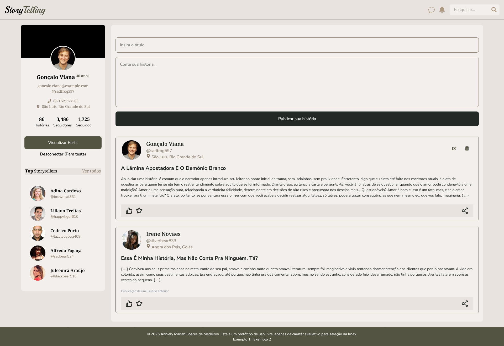
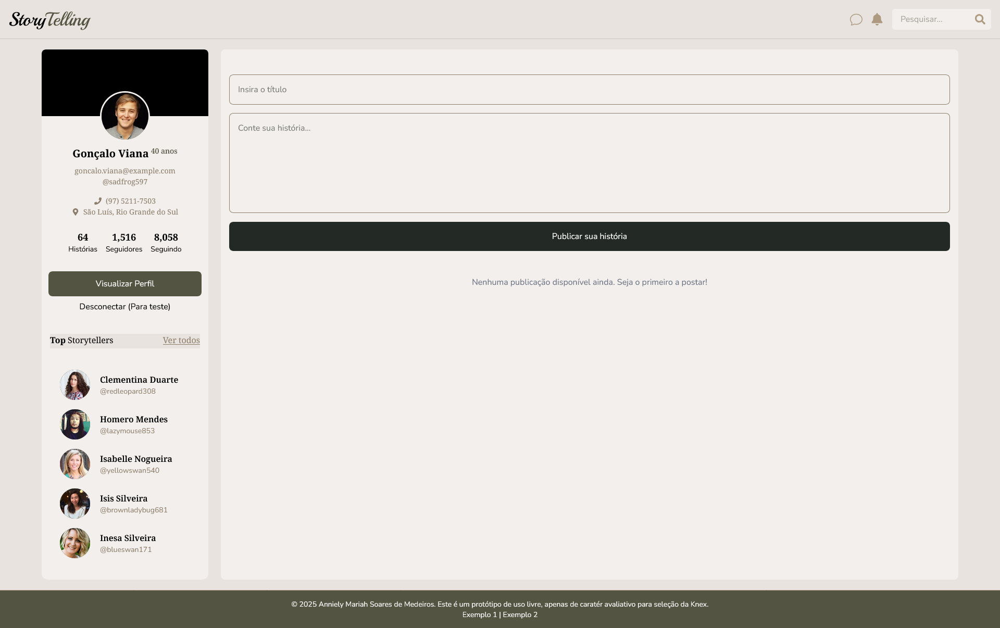
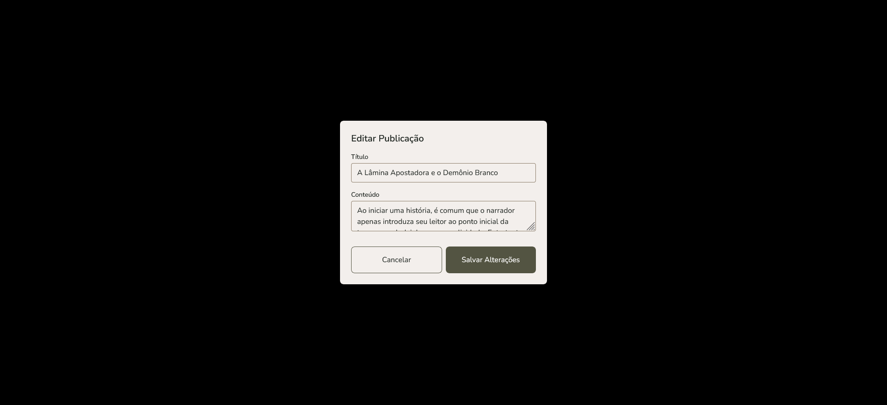

<h1 align="center">Teste de Seleção da Knex - Frontend</h1>

<h2 align="center">StoryTelling: Plataforma de Pequenas Histórias</h2>

**StoryTelling** é uma aplicação web desenvolvida para o desafio da seleção front-end da Knex. Seu objetivo é simular uma rede social de pequenas histórias, com funcionalidades de visualização, criação, edição e exclusão de posts, utilizando dados de usuários gerados dinamicamente.

---

## 🚀 Tecnologias Utilizadas

* **React (v19.1.0)** — Biblioteca principal para construção da interface
* **React Router DOM (v7.6.2)** — Gerenciamento de rotas
* **React Icons (v5.5.0)** — Biblioteca de ícones para React
* **Axios (v1.10.0)** & **Fetch API** — Requisições HTTP
* **Zod (v3.25.67)** — Validação de dados
* **Tailwind CSS (v4.1.10)** — Estilização responsiva e moderna
* **Universal Cookie (v8.0.1)** — Gerenciamento de cookies
* **Prettier e EsLint** — Para organização de código front-end.

---

## 📌 Desafio Proposto

Desenvolver uma tela com operações de **CRUD (Create, Read, Update, Delete)** para posts vinculados a um usuário aleatório. A interface deve simular uma rede social, com **Header** e **Footer** contendo logotipo e barra de navegação (mesmo que não funcional).

---

## 👤 Funcionalidades de Usuário (via API RandomUser)

1. **Exibição dos dados do usuário "logado":**

   * Nome completo
   * Foto de perfil
   * E-mail
   * Telefone
   * Idade
   * Localização (preferencialmente usuários brasileiros)

2. **Persistência do usuário:**

   * Um token SHA256 é gerado e armazenado em **cookies**
   * A cada reload, um novo usuário é carregado automaticamente

---

## ✍️ Funcionalidades dos Posts (via API JSONPlaceholder)

1. **Exibição de posts:**

   * Título e conteúdo
   * Associação de cada post a um ID
   * Layout semelhante ao de redes sociais

2. **Integração com dados do usuário:**

   * Nome, localização e imagem do usuário aplicados visualmente em cada post

3. **Criação de novo post:**

   * Botão para criar post
   * Integração com o endpoint de criação da API JSONPlaceholder

---


## 🔗 APIs Utilizadas

* 👤 [RandomUser API](https://randomuser.me/documentation)
* 📝 [JSONPlaceholder API](https://jsonplaceholder.typicode.com/guide/)

---

## ✅ Entregas Realizadas

* Tela responsiva com layout inspirado em redes sociais
* Exibição dinâmica de dados do usuário e posts
* Criação de novos posts
* Gerenciamento básico de estado e persistência com cookies
* Estilização moderna utilizando Tailwind CSS
### 🎨 Imagens da Aplicação e Prototipação do Figma

Abaixo segue as imagens da aplicação em tempo real, caso deseje comparar com o Figma criado por mim, clique aqui: [Figma](https://www.figma.com/design/dXCovOxqN0KRV6wPs9wK9I/Storytelling?node-id=0-1&t=uwxonSkhAn4m3Bdc-1)

<table>
  <tr>
    <td>
      <br/>
      <br/>
      
    </td>
    <td>
      
    </td>
  </tr>
</table>

---

## ⚠️ Observação Importante

   Durante os testes, foi identificado um problema com **atualização e exclusão de posts** devido ao **retorno fixo do ID `101`** ao criar novos posts via JSONPlaceholder. Isso impede a manipulação correta desses dados recém-criados e pode ocasionar a exclusão visual de todos os posts. No entanto, **não se trata de uma falha na lógica do frontend** — caso a API passe a retornar IDs válidos e únicos, o código funcionará corretamente.


---

## 🛠️ Instalação e Execução Local

Siga os passos abaixo para rodar o projeto localmente:

### 1. Clone o repositório

```bash
git clone https://github.com/annielymariah/knex-selection-challenges.git
```

### 2. Acesse o diretório do projeto

```bash
cd knex-selection-challenges/frontend
```

### 3. Instale as dependências

```bash
npm install
# ou
yarn install
```

### 4. Inicie o servidor de desenvolvimento

```bash
npm run dev
# ou
yarn dev
```

A aplicação estará disponível em: [http://localhost:5173](http://localhost:5173)

